# Лабораторная №1: Анализ заголовка исполняемого файла ОС windows

**Исполняемый файл** – это файл, содержащий набор инструкций, который при загрузке в память компьютера и последующем выполнении процессором приводит к выполнению определенной задачи или программы. При попытке открыть такой файл, и попытаться его прочитать, то можно увидеть следующий набор байт, которые не очень понятны человеку

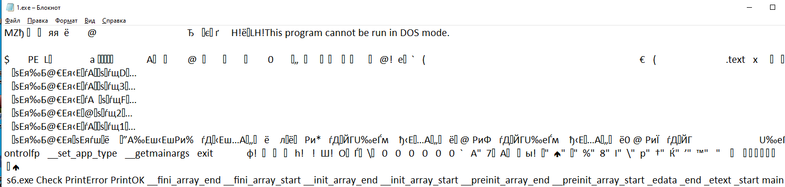

Для того, чтобы исполнить той или иной файл, его необходимо преобразовать с человеческого, на язык машины. Для этого используется **компилятор** или **интерпретатор.**

Основное отличие между ними, заключается в результате:

1. В случае **компилятора,&#x20;**&#x440;езультирующий файл содержит машинные инструкции, которые сможет понять процессор
2. В случае **интерпретатора,&#x20;**&#x435;сть 2 варианта развития событий:
   * Если используются такие языки программирования, как **python, ruby, javascript...,&#x20;**&#x442;о блоки кода из исходников переводятся в **байт-код**, а при помощи виртуальной машины (не путать с гипервизорами) переводятся в код, понятный **CPU**
   * Если используются такие языки программирования, как **java, C#...,&#x20;**&#x442;о исходники целиком компилируется в **байт-код**, ну а после исполняются на виртуальной машине.

Основная разница между этими 2 способами (**компиляцией и интерпретацией**) заключается в:

1. Кроссплатформенность
   1. В **компилируемых&#x20;**&#x44F;зыках ее намного тяжелее реализовать
   2. В **интерпретируемых&#x20;**&#x44F;зыках ее намного проще реализовать.
       
2. Легче использовать
   1. Нет
   2. Намного проще чем **машинно-ориентированные**
3. Доступ к памяти
   1. Есть
   2. Нету
4. Виртуальная машина.
   1. Не нужна
   2. Нужна

Хоть в больщенстве случаем используют "безопасные" языки программирования как **java, python, javascript.&#x20;**&#x41D;о все же для более "серьезных" проектов используют машинно-ориентированные.

То же самое и касается **MalDev&#x20;**(разработки малвари), ввиду того чтобы провести процесс, обратный компиляции нужно "попотеть"

# Процесс компиляции

Можно выделить 4 этапа получения исполняемого файла из исходников:

1. Препроцессинг
2. Компиляция
3. Ассемблирование
4. Компановка

## Препроцессинг

**Препроцессор** – это программа, которая обрабатывает исходный код перед его передачей компилятору. Основная цель **препроцессора** – подготовить исходный код к компиляции, выполняя ряд операций, которые могут включать в себя макросы, включение файлов, условную компиляцию и другие виды обработки. Например, в языках программирования C и C++, препроцессор добавляет заголовочные файлы в код через директивы #include, удаляет комментарии, заменяет макросы (определенные с помощью #define) их значениями, а также выбирает определенные блоки кода в зависимости от условий, заданных директивами #if, #ifdef, и #ifndef.

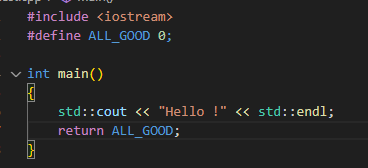

## Компиляция

На этом этапе компилятор выполняет свою основную функцию:**компилирует**, то есть преобразует код, очищенный от директив препроцессора, в ассемблерный код. Этот шаг является промежуточным между высокоуровневым языком программирования и машинным кодом.

## Ассемблирование

**Ассемблерный код -&#x20;**&#x44D;то доступное для понимания человеком представление машинного кода. Код на языке ассемблера все еще человек сможет понять, но вот процессор не сможет, поэтому необходимо перевести ассемблерный код в машинный с помощью ассемблера.**&#x20;Ассемблирование** – это процесс, при котором **ассемблер** преобразовывает ассемблерный код в машинный код, при этом сохраняя его в объектном файле. **Объектный файл** – это промежуточный файл, который создается ассемблером и содержит фрагмент машинного кода. Этот фрагмент машинного кода, еще не объединен с другими частями кода для создания окончательного исполняемого файла.

## Компоновка

**Компоновщик&#x20;**(линкер от англ. linker)**&#x20;**&#x43E;бъединяет все объектные файлы в единый исполняемый файл. Для выполнения этой задачи требуется **таблица символов**.**Таблица символов&#x20;**– это структура данных, которую создает компилятор и которая хранится в объектных файлах. В этой таблице содержатся имена переменных, функций, классов, объектов и прочих идентификаторов, а также их типы и области видимости. Кроме того, таблица символов хранит адреса ссылок на данные и процедуры, находящиеся в других объектных файлах. Именно с помощью**таблицы символов&#x20;**&#x438; содержащихся в ней ссылок **компоновщик&#x20;**&#x43C;ожет устанавливать связи между данными в разных объектных файлах и таким образом создать из них единый исполняемый файл.

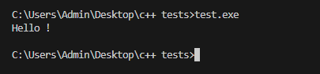

# Анализ результата компиляции

Для того, чтобы системный загрузчик смог загрузить исполняемый файл, полученный в результате **компиляции,&#x20;**&#x441; постоянно запоминающего устройства, в оперативную память, ему необходимо узнать сколько ресурсов требуются исполняемому файлу. Для этого у каждого исполняемого файла есть заголовки, которые содержат различную информацию о файле.

На ОС **Windows&#x20;**&#x441;уществует несколько типов исполняемых файлов, каждый из которых предназначен для определенной цели и имеет свои особенности. Вот основные типы исполняемых файлов:

**Файлы с расширением .EXE –&#x20;**&#x42D;то наиболее распространенный тип исполняемых файлов в Windows. Файлы .exe содержат машинный код, который может быть выполнен процессором.

**Файлы с расширением .DLL –&#x20;**&#x414;инамические библиотеки (**Dynamic Link Libraries**) – это файлы, содержащие машинный код, который может быть использован другим&#x438;**.EXE** ил&#x438;**.DLL**. Они позволяют разделять код между несколькими программами, что способствует модульному проектированию. Хотя на самом деле всевозможные типы расширений, это всего лишь прерогатива, для удобства пользователей, которая реализована в файловой системе, операционной системы **Windows. (NTFS)**

## Формат PE-файла

Эти типы файлов имеют общий формат под названием, «переносимый исполняемый» (**Portable Executable,&#x20;**&#x442;акж&#x435;**&#x20;PE).&#x20;**&#x424;ормат **PE** представляет собой структуру данных, содержащую всю информацию, необходимую системному загрузчику для отображения (загрузки) файла с постоянно запоминающего устройства в оперативную память компьютера. Форма&#x442;**&#x20;PE**-файла, выглядит следующим образом:

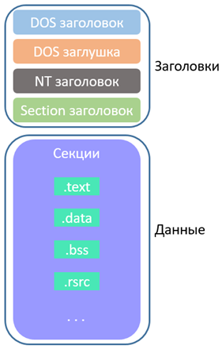

##

## DOS заголовок

**DOS заголовок&#x20;**&#x44F;вляется обязательным для загрузки исполняемого файла, хоть и не несёт в себе большой смысловой информации. Также он необходим, для того, если **PE**-файл запустить на операционной системе **DOS**, то пользователь увидел сообщение **«This program cannot be run in DOS mode».**

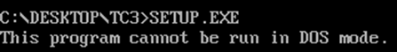

Вывод данного текста, является результатом исполнения так называемой **DOS заглушки (DOS Stub).&#x20;**&#x42D;то программа, которая сработает только в том случае, если **PE**-файл попытаться запустить в операционной системе DOS.

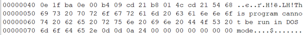

**DOS заглушка** находится под **DOS заголовком**, а сама структура **DOS заголовка** выглядит следующим образом, где основными полями являются **e\_magic** и **e\_lfanew**

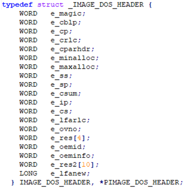

**e\_magic&#x20;**&#x441;одержит, так называемое «магическое число» 0x4D5A(**MZ**), в честь инженера который работал над архитектурой исполняемого файла, которого звали **Mark Zbikowski.**

**e\_lfanew –&#x20;**&#x441;одержит смещение на **NT** заголовок.

## NT заголовок

**NT заголовок -&#x20;**&#x442;акже известный как PE-заголовок, представляет собой важную часть структуры формата PE-файл&#x430;**.&#x20;**&#x414;анная структура состоит из 3 частей, при этом для **x86** и **x64** архитектур, структура **NT заголовка** отличается: поле **Signature**, структура **IMAGE\_FILE\_HEADER,&#x20;**&#x430; также структура **IMAGE\_OPTIONAL\_HEADER.&#x20;**&#x421;труктура **NT заголовка** для **x86** и **x64** выглядит следующим образом:

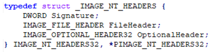

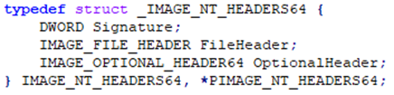

Поле **Signature&#x20;**– имеет фиксированное значение 0x50400000, которое равносильно PE\0\0, если перевести в ASCII.

Структура **IMAGE\_FILE\_HEADER** размером 20 байт, содержит общую информацию о **PE-файле**. Структура **IMAGE\_OPTIONAL\_HEADER&#x20;**&#x43D;е имеет постоянного размера, поэтому ее размер хранится в одном из полей структуры **IMAGE\_FILE\_HEADER.&#x20;**&#x425;оть данный заголовок и называется опциональным, на самом деле это самый важный заголовок **PE**-файла.

Сама структура **IMAGE\_FILE\_HEADER&#x20;**&#x432;ыглядит следующим образом, где основными полями являются **Machine**, **NumberOfSections, TimeDateStamp, SizeOfOptionalHeader**,**Characteristics**:

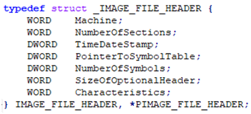

**Machine** - содержит значение, архитектуры процессора, под которую компилировался файл. Значения, которые может принять данное поле:

**0x014С&#x20;**- означает, что программа может выполняться на x32 битных системах.

**0x0200**- означает, что программа может выполняться на процессорах Intel x64

**0x8664**- означает, что программа может выполняться на процессорах AMD64.

**NumberOfSections&#x20;**- содержит количество секций PE-файла **(\*О секциях чуть позже)**

**TimeDateStamp -&#x20;**&#x441;одержит значение, равное дате создания **PE**-файла, формате **Unix timestamp**. Unix timestamp – это система представления времени, принятая в **Unix** операционных системах. Она определяется как количество секунд, прошедших с полуночи 1 января 1970 года.

**SizeOfOptionalHeader -&#x20;**&#x441;одержит размер **IMAGE\_OPTIONAL\_HEADER.**

**Characteristics -&#x20;**&#x441;одрежит различные атрибуты **PE**-файла. Например, является ли **PE**-файл .exe или .dll. Также, тут описано, является ли данная программа x64-битной или x32-битной.

Структура **IMAGE\_OPTIONAL\_HEADER&#x20;**&#x432;ыглядит следующим образом, где основными полями являются: **Magic, SizeOfCode, SizeOfInitializedData, SizeOfUninitializedData, AddressOfEntryPoint, ImageBase, SectionAlignment, FileAlignment, SizeOfImage, SizeOfHeaders, NumberOfRvaAndSizes.**

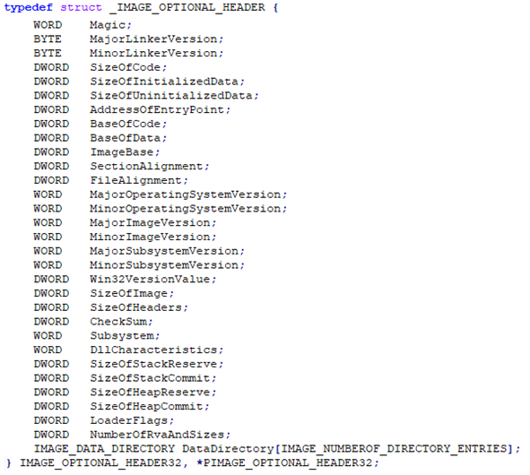

**Magic -**&#x437;начение этого поля определяет, является ли исполняемый файл 32-разрядным (0x10B) или 64-разрядным (0x20B).

**SizeOfCode** - содержит физический размер секции, в которой расположены машинные инструкции (по умолчанию название секции **.text**).

**SizeOfInitializedData&#x20;**- содержит физический размер секции с инициализированными данными (по умолчанию название секции **.data**).

**SizeOfUninitializedData** - содержит физический размер секции с неинициализированными данными (по умолчанию название секции.**&#x20;bss**).

**AddressOfEntryPoint&#x20;**&#x441;одержит **RVA&#x20;**&#x442;очки входа в программу (По умолчанию - это смещение задается с функции **main&#x20;**&#x432; исходниках программы), когда **PE-файл** загружается в память.
**RVA** – Это аббревиатура от английского термина "**Relative Virtual Address**" и означает смещение в байтах от начала реального или предполагаемого адреса загрузки **PE**-файла в память.

Например, если **PE**-файл загрузился в памяти по адресу **0x400000
AddressOfEntryPoint = 0x1000**, то **Virtual Addres&#x20;**(VA) точки входа (**Entry Point**) в программу будет **равняться 0x400000 + 0x1000 = 0x401000.**

**ImageBase&#x20;**&#x441;одержит адрес по которому **PE**-файл загрузиться в память. Размер поля зависит от архитектуры. Если **PE**-файл 32 разрядный, то размер поля равен 4 байтам, иначе размер поля 8 байт.

**SectionAlignment&#x20;**&#x441;одержит значение, которое используется для выравнивания секций **PE**-файла в памяти (в байтах), секции выравниваются по границам памяти, кратным этому значению. В большинстве случаев значение данного поля равно **0x1000**, так как у большинства архитектур страницы памяти имеют данный размер.

**FileAlignment&#x20;**&#x441;одержит значение, которое используется для выравнивания физических данных по границе, равной 0x200, так как один сектор жесткого диска или твердотельного накопителя равен как раз данному значению.

**SizeOfImage**, содержит значения виртуального размера всего образа **PE**-файла в памяти, данное поле используется во время загрузки **PE**-файла в память.

**SizeOfHeaders**, содержит выровненный по **FileAlignment&#x20;**&#x440;азмер всех заголовков **(DOS,NT,Section).**

**NumberOfRvaAndSizes -&#x20;**&#x441;одержит количество элементов массива **DataDirectory.** 

**DataDirectory&#x20;**– это массив структур **IMAGE\_DATA\_DIRECTORY**

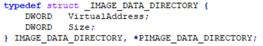

**VirtualAddress** хранит значение **RVA&#x20;**&#x442;ой или иной директории.

**Size** хранит значение размера директории, на которую указывает поле **VirtualAddress**. Каждый элемент массива **DataDirectory&#x20;**&#x438;меет определенную константу (индекс).

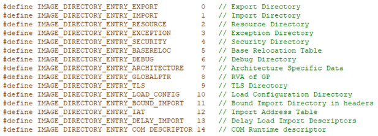

**(\*Основные директории, для правильного работы PE-файла в оперативной памяти, будут разобраны дальше)&#xA;**&#xA;
После **NT заголовка**, идет **IMAGE\_SECTION\_HEADER**, который описывает различную информацию о той или иной секции данных **PE**-файла. Количество таких структур зависит от поля **NumberOfSections&#x20;**&#x432; структуре **IMAGE\_FILE\_HEADER.&#x20;**&#x421;труктура заголовка секции занимает 40 байт, и выглядит следующим образом:

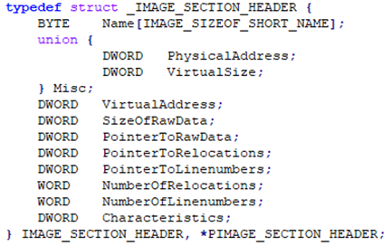

**Name** – представляет собой массив, размером 8 байт, который содержит имя секции. Имя секции может быть любым, но при получении **PE**-файла в результате компиляции, обычно ставятся имена: **.text** для исполняемой секции, **.data** для инициализированных данных, **.bss** для неинициализированных данных.

Объединение полей **PhysicalAddress&#x20;**&#x438; **VirtualSize&#x20;**&#x43E;пределяет несколько имен одного и того же объекта, это поле содержит общий размер секции при ее загрузке в память.

**VirtualAddress&#x20;**– хранит в себе выровненный по **SectionAlignment,  RVA&#x20;**&#x43D;ачала секции.

**SizeOfRawData –&#x20;**&#x441;одержит выровненный по **FileAlignment&#x20;**&#x444;изически&#x439;**&#x20;**&#x440;азмер секции.

**PointerToRawData –&#x20;**&#x444;изическое смещение начала секции.

**PointerToRelocations -**&#x443;казатель файла на начало записей о перемещении секции. Он установлен 0 для исполняемых файлов.

**PointerToLineNumbers -**&#x443;казатель файла на начало записей номеров строк COFF для секции. Установлено значение, 0 поскольку отладочная информация COFF устарела.

**NumberOfRelocations -&#x20;**&#x43A;оличество записей перемещения для раздела, заданное 0 для исполняемых изображений.

**NumberOfLinenumbers -**&#x43A;оличество записей номеров строк COFF для раздела, оно установлено, 0 так как отладочная информация COFF устарела.

**Characteristics**- Флаги, описывающие характеристики раздела. Этими характеристиками являются такие вещи, разрешения на чтение, запись или исполнения тех или иных байт, в различных секциях.

# Основные директории PE-файла

## Экспорты PE-файла

Таблица экспорта - это структура, определенная как **IMAGE\_EXPORT\_DIRECTORY**.

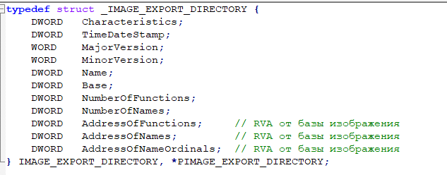

Можно выделить 3 элемента данной структуры

**AddressOfFunctions&#x20;**- указывает на адрес массива, с адресами экспортированных функций.
**AddressOfNames&#x20;**- указывает на адрес массива, с адресами на имена экспортируемых функций.
**AddressOfNameOrdinals&#x20;**- указывает на адрес массива, с порядковыми номера для экспортированных функций.

**Порядковый номер функции&#x20;**- это целочисленное значение, представляющее позицию функции в таблице экспортированных функций в **DLL**. Таблица экспорта организована в виде списка (массива) указателей на функции, каждой функции присваивается порядковое значение на основе ее положения в таблице.

Также стоит отметить, что порядковое значение используется для идентификации адреса функции, а не ее имени. Таблица экспорта работает таким образом, чтобы обрабатывать случаи, когда имя функции недоступно или не уникально. Кроме того, получение адреса функции с помощью ее порядкового номера происходит быстрее, чем с помощью ее имени. По этой причине операционная система использует порядковый номер для извлечения адреса функции.

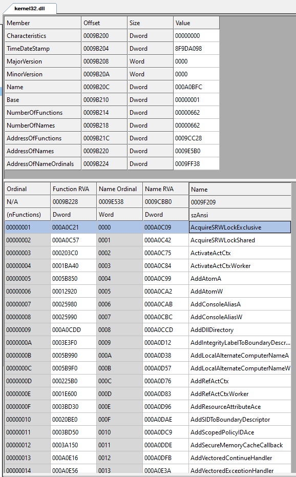

## Импорты PE-файла

**Директория импорта&#x20;**(Import Directory) – это структура данных, которая содержит информацию о функциях, которые **EXE&#x20;**&#x438;ли **DLL&#x20;**&#x438;мпортируют из других **DLL**. **Директория импортов&#x20;**&#x43E;дна из самых важных частей любого **PE**-файла, так как просто невозможно найти **EXE&#x20;**&#x438;ли **DLL&#x20;**&#x444;айлы без каких-либо данных, имеющих отношение к импорту, разве что у каких-нибудь **обфусцированных ВПО**. Импорт позволяет указать, какие внешние функции и из каких модулей требуются исполняемому файлу для нормальной работы. Например, если написать программу, которая выводит строку «**Hello, world!**», в **MessageBox'е&#x20;**&#x438; завершает выполнение при помощи функции **ExitProcess**, то такой программе потребуются как минимум две функции:

**MessageBoxA&#x20;**&#x438;з **User32.dll&#x20;**&#x438; **ExitProcess&#x20;**&#x438;з **Kernel32.dll**.

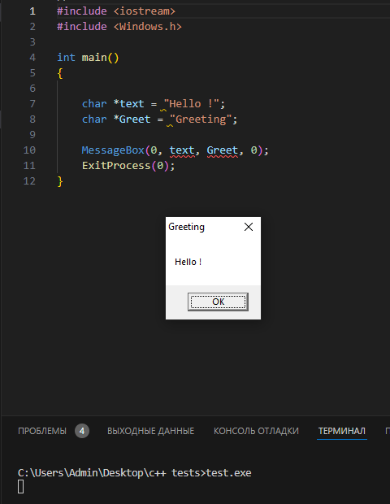

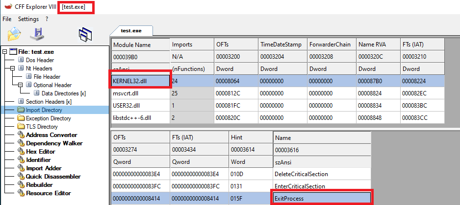

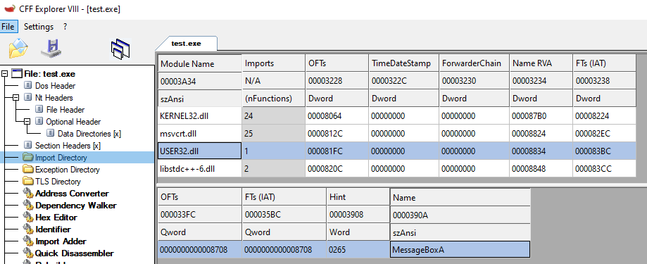

**Импорт через таблицу импортируемых функций****&#x20;**- загрузчик заполняет соответствующую таблице функций, таблицу их адресов после загрузки в адресное пространство исполняемого файла всех необходимых библиотек. Данный метод хорош, когда импортируется малое количество **DLL**, а также функций из них, так как при загрузке **PE**-файла в оперативную память, загрузчику необходимо разобрать всю таблицу импорта, и если в таблице много функций, то это займет какое-то время (хотя всеравно не критично, так что ок).

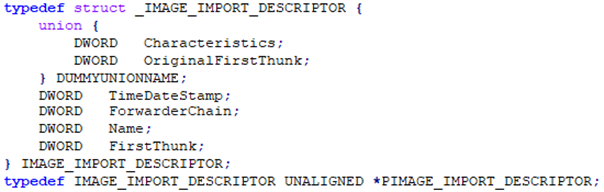

Размер данной структуры 20 байт, и каждая такая структура однозначно идентифицирует ту или иную импортируемую библиотеку (**DLL**), а также функции из этой библиотеки, тем самым таблица импортов – это массив таких структур, а конец этого массива обозначается следующим образом.

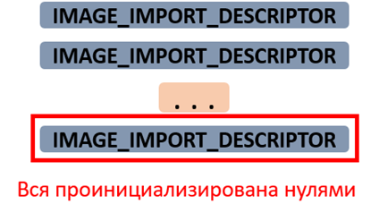

**OriginalFirstThunk&#x20;**&#x438; **Characteristics&#x20;**– это название одного и того же поля, в котором хранится **RVA,&#x20;**&#x442;ак называемой **LookUp**-таблицы. Данная таблица содержит **RVA&#x20;**&#x43D;а начало массива, в котором элементами являются **RVA** на имена импортируемых функций.

**TimeDateStamp&#x20;**– используется в другомспособе импорта функций, а в данном методе всегда равно 0.

**ForwarderChain&#x20;**– не используется, поэтому равно 0.

**Name&#x20;**– в данном поле находится**RVA&#x20;**&#x438;мени импортируемой**DLL.**

**FirstThunk&#x20;**– Данная таблица содержит **RVA&#x20;**&#x43D;а начало массива, в котором элементами являются **RVA** на имена импортируемых функций. Основная разница между **OriginalFirstThunk&#x20;**&#x438;**&#x20;FirstThunk,&#x20;**&#x432; том, что системный загрузчик будет заменять элементы массива, с **RVA** на имена функций, на настоящие адреса функций.

Для получения адреса таблицы импорта, необходимо к адресу, по которому загрузился **PE**-файл в память прибавить значение **VirtualAddress,&#x20;**&#x441;труктур&#x44B;**&#x20;DataDirectory,&#x20;**&#x43F;о константному индеку **IMAGE\_DIRECTORY\_ENTRY\_IMPORT.**

**Привязанный импорт** (Bound Import) – это техника, при которой адресное пространство исполняемого файла заранее связывается с динамическими библиотеками (DLL), а таблица импорта уже содержит фиксированные адреса импортируемых функций. Это означает, что адреса импортируемых функций определяются и записываются компоновщиком во время компиляции. Использование **привязанного импорта&#x20;**&#x443;скоряет загрузку **исполняемого файла**, поскольку загрузчику не нужно искать адреса функций при запуске программы – они уже "зашиты" в таблицу импорта. Этот подход оптимизирует время загрузки, но имеет один недостаток: любое изменение в динамических библиотеках потребует перекомпиляции или повторной привязки исполняемого файла, чтобы обновить все адреса функций.
Несмотря на этот недостаток, привязанный импорт широко используется в стандартных исполняемых файлах **Windows**, таких как Калькулятор, Сапёр, Блокнот, поскольку стандартные библиотеки Windows изменяются крайне редко.

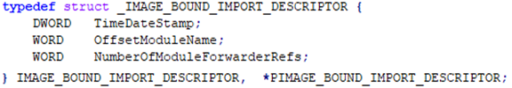

**TimeDateStamp&#x20;**– отметка времени и даты импортированной DLL, также и проставляется в **TimeDateStamp**в**IMAGE\_IMPORT\_DESCRIPTOR.**

**OffsetModuleName &#x20;**– Смещение строки с именем импортированной DLL.

Это отклонение от первого **IMAGE\_BOUND\_IMPORT\_DESCRIPTOR**

**NumberOfModuleForwarderRefs&#x20;**– количество структур **IMAGE\_BOUND\_FORWARDER\_REF**, следующих непосредственно за этой структурой.

**IMAGE\_BOUND\_FORWARDER\_REF&#x20;**– это структура, идентичная **IMAGE\_BOUND\_IMPORT\_DESCRIPTOR**, с той лишь разницей, что последний член зарезервирован.

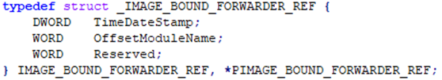

Для получения адреса директории привязанного импорта, необходимо к адресу по которому загрузилсяPE-файл в память прибавить значение массива **DataDirectory,&#x20;**&#x43F;о константному индексу **IMAGE\_DIRECTORY\_ENTRY\_BOUND\_IMPORT.**

**Отложенный импорт****&#x20;(**&#x64;elay import) – основная идея данного способа, состоит в вызове некоторого обработчика, который должен получить адрес требуемой функции и записать его в таблицу адресов импортируемых функций, по мере необходимости. Для получения адреса директории привязанного импорта, необходимо к адресу, по которому загрузился **PE**-файл в память прибавить значение массива **DataDirectory,&#x20;**&#x43F;о константному индексу **IMAGE\_DIRECTORY\_ENTRY\_DELAY\_IMPORT**.

## Релокации PE-файла

**Релокации** (перемещения) необходимы **PE**-файлу, для того чтобы, если образ **PE**-файла загрузился по адресу отличному от поля **ImageBase&#x20;**&#x441;труктуры **IMAGE\_OPTIONAL\_HEADER**, то можно было пересчитать «жестко» привязанные адреса. Например для такого листинга кода:
**int t = 2;
int\* t\_ptr = \&test;**
Во время компиляции, компилятор примет базовый адрес (**ImageBase**), пусть он будет равен **0x5000**, а также переменная **t** расположена со смещением, **0x1000**, и на основе этого, он дает переменной **t\_ptr** значение, равное **0x6000**. Позже запускается программа, и образ **PE**-файла загружается в память, при этом с базовым адресом **0x10000**, это означает, что «жестко» привязанное значение переменной **t\_ptr&#x20;**&#x431;удет ошибочным, поэтому системный загрузчик исправляет это значение, путем добавления разницы между предполагаемым базовым адресом и фактическим базовым адресом, в данном примере это разница равна **(0x10000 - 0x5000) = 0x5000,&#x20;**&#x43F;оэтому новое значение **t\_ptr&#x20;**&#x431;удет равно **(0x5000 + 0x6000) = 0x11000**, которое является правильным новым адресом переменной **t**. Для того чтобы понять, какие значения являются «жестко» привязанными, у **PE**-файла, есть директория релокаций. Данная директория, разделена на блоки, каждый блок представляет собой базовые перемещения для страницы, и каждый блок должен начинаться с **32**-битной границы. Каждый блок начинается со **IMAGE\_BASE\_RELOCATION** структуры, за которой следует любое количество записей поля смещения. Структура **IMAGE\_BASE\_RELOCATION&#x20;**&#x432;ыглядит следующим образом.

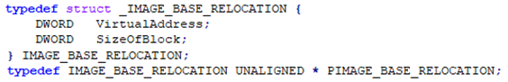

## Ресурсы PE-файла

**Ресурсы PE-файла**– включают в себя различные элементы, такие как иконки, изображения, диалоговые окна, строки, меню, курсоры, шрифты и другие типы данных, необходимые для работы приложения или его графического интерфейса. Для того чтобы данные ресурсов отображались на диске должным образом необходимо не упаковывать следующие типы ресурсов: **Иконки**,**Манифест**,**Информацию о версии**, соответственно **упаковщику**необходимо пересобрать директорию ресурсов.

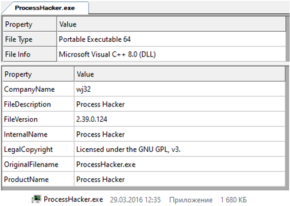

Сама директория ресурсов имеет древоподобный вид:

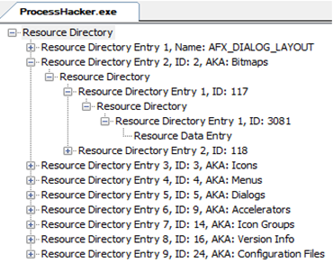

Вложения выглядят следующим образом:

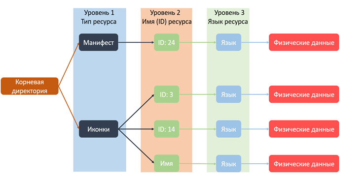

В **корневой директории** (Resource Directory) сначала располагаются записи, указывающие на **тип ресурса**. В них вложены директории с записями, содержащими **имя** или **ID ресурса**, а в них, в свою очередь, вложены директории с записями, указывающими **язык ресурса**. Последние содержат директорию данных, которая указывает уже на данные ресурса. 

# Задание для выполнения лабораторной работы № 1

Необходимо написать анализатор PE-файла (проще говоря парсер), который должен выводить следущаю информацию о PE-файле

1. Название анализируемого файла
2. Под какую архитектуру была скомпилированна программа (значение поля **Machine**)
3. Значение поля **Characteristics&#x20;**(&#x432;**&#x20;**&#x46;ileHeader)**&#x20;**&#x432; таком формате (То есть парсила значение бит)

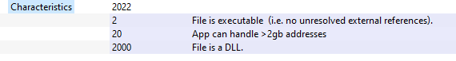

1. Значение поля **Magic&#x20;**&#x432; опциональном заголовке
2. Адрес (Смещение) точки входа в программу (Entry Point)
3. Адрес загрузки образа по умолчанию
4. Физическое выравнивание
5. Виртуальное выравнивание
6. Размер образа PE-файла в памяти
7. Значение поля **DLL Characteristics&#x20;**&#x432; опциональном заголовке, в таком виде

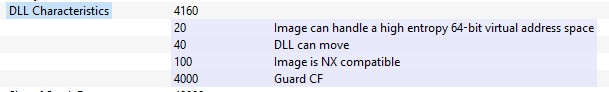

1. Если у исполняемого файла есть таблица экспортов, то анализатор должен ее пропарсить и вывести все экспортируемые функции
2. Если у исполняемого файла есть таблица импортов, то анализатор должен ее пропарсить и вывести все названия импортируемых **DLL**, а также функций из **DLL**

   То есть:

   &#x20;   **Kernel32.DLL**

   &#x20;       ...

   &#x20;   **User32.DLL**

   &#x20;       ...

   &#x20;   И так далее
3. Если у исполняемого файла Релокации, то анализатор должен об этом предупредить
4. Если у исполняемого файла есть Ресурсы, то анализатор должен об этом предупредить
5. Необходимо пропарсить все секции исполняемого файла, и вывести следующую информацию:
   1. Название секции
   2. Виртуальный размер секции
   3. Виртуальный адрес секции
   4. Физический размер секции
   5. Физическое смещение секции
   6. Характеристики файла в таком формате (То есть буквами, а не цифрами, чтобы можно было понять какие есть права у секции)
   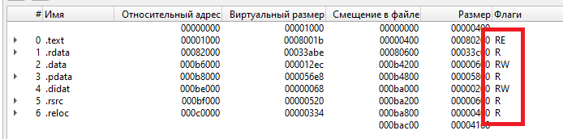

* Необходимо приложить исходник программы написаной на **C++**
* Показать на скриншотах процесс написания кода, с комментариями, что и для чего делали
* Протестировать парсер, на этих файлах, приложить скриншоты результата

   [PE1](./files/PE1.dll)  
   [PE2](./files/PE2.dll)

